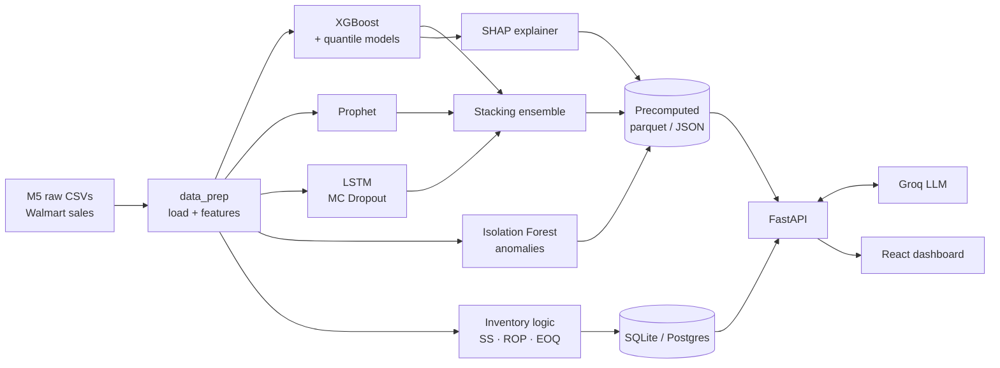

# Demand IQ — AI Inventory Demand Forecasting

> **Smart India Hackathon 2026 prototype.** Forecasts daily product demand, recommends when and
> how much to reorder, flags unusual demand, and explains every prediction in plain language.

Demand IQ combines three forecasting models (**XGBoost, Prophet, LSTM**) in a learned **stacked
ensemble**, turns the forecasts into **safety stock, reorder points and order quantities**,
detects **demand anomalies** with Isolation Forest, and makes the models transparent with
**SHAP explainability** and a **Groq-powered AI assistant**.


---

## Features

| Module | What it does |
|---|---|
| **Forecast Explorer** | Daily demand forecasts from each model with prediction intervals, plotted against actual sales |
| **Stacked Ensemble** | A non-negative linear meta-model learns how much to trust each base model, evaluated on a separate window so there is no leakage |
| **Inventory Manager** | Safety stock, reorder point, EOQ, and days until reorder per product, with *Reorder now* / *Reorder soon* / *Healthy* status |
| **Anomaly Alerts** | Isolation Forest flags demand spikes and drops relative to recent context, graded low, medium or high |
| **Model Comparison** | RMSE, MAE, MAPE and WAPE for every model on the same holdout window, plus the learned blend weights |
| **SHAP Explainer** | Per-prediction feature contributions (why *this* forecast?) and global feature importance |
| **What-If Simulator** | Change lead time, service level, ordering cost and holding cost to see the live impact on stock policy and holding cost |
| **AI Assistant** | Chat that answers questions using the live dashboard numbers (Groq, rate-limited) |

The dashboard is responsive, from desktop sidebar to phone top-bar, and handles free-tier server
cold starts gracefully.

---

## Results

All models are scored on the **same 14-day meta-test window** (5 products × 14 days = 70 rows):

| Model | RMSE ↓ | MAE ↓ | MAPE ↓ | WAPE ↓ |
|---|---|---|---|---|
| **XGBoost** | **5.14** | **3.69** | 33.2% | **19.0%** |
| Stacked Ensemble | 5.37 | 3.79 | **33.1%** | 19.5% |
| LSTM | 6.17 | 4.37 | 37.4% | 22.5% |
| Prophet | 6.49 | 4.71 | 35.5% | 24.3% |

Learned ensemble weights: XGBoost **0.673**, LSTM **0.322**, Prophet **0.000**. Once XGBoost and
LSTM are known, Prophet adds no extra signal.

---

## Architecture



**Train offline, serve precomputed results.** The ML pipeline runs locally and writes its outputs
to `backend/data/processed/` and `backend/ml/models/`. The deployed API only reads those files,
so it needs no TensorFlow or Prophet at runtime. That keeps the server light enough for a
512 MB free instance.

---

## Tech Stack

- **ML:** XGBoost (point + 10th/90th quantile models), Prophet, TensorFlow/Keras LSTM, scikit-learn (stacking, Isolation Forest), SHAP
- **Backend:** FastAPI, SQLAlchemy, pandas / PyArrow, SQLite (or any Postgres via `DATABASE_URL`)
- **AI:** Groq API (`openai/gpt-oss-20b`)
- **Frontend:** React 18, Vite, Recharts, lucide-react
- **Deployment:** Render Blueprint (`render.yaml`): API web service + static site

---

## Dataset

[M5 Forecasting — Accuracy](https://www.kaggle.com/competitions/m5-forecasting-accuracy)
(Walmart daily unit sales, 2011–2016). The prototype uses **5 FOODS SKUs from store CA_1**,
labelled Milk, Yogurt, Cheese, Eggs and Bread for a clear demo story.

The two large raw files are not in this repo because of their size. To retrain, download them
from Kaggle into `backend/data/raw/`:

```
backend/data/raw/sales_train_evaluation.csv   (~120 MB)
backend/data/raw/sell_prices.csv              (~200 MB)
backend/data/raw/calendar.csv                 (included)
```

You do **not** need them to run the dashboard. All trained outputs are already committed.

---

## Quick Start (local)

### 1. Backend

```bash
cd backend
python -m venv venv
venv\Scripts\activate            # Windows
# source venv/bin/activate       # macOS / Linux
pip install -r requirements.txt
```

Create `backend/.env` (optional; only needed for the AI assistant):

```env
GROQ_API_KEY=gsk_your_key_here   # free key: https://console.groq.com/keys
```

Run the API:

```bash
uvicorn api.main:app --reload --port 8000
```

Interactive API docs: <http://localhost:8000/docs>

### 2. Frontend

```bash
cd frontend
npm install
npm run dev
```

Open <http://localhost:5173>. The Vite dev server proxies API calls to `localhost:8000`.
If port 8000 is busy, set `API_PROXY=http://localhost:<port>` before `npm run dev`.

---

## Retraining the Models

```bash
cd backend
pip install -r requirements-train.txt      # adds XGBoost, Prophet, TensorFlow, SHAP, scikit-learn

python -m data_prep.load_m5_data           # 1. load M5 → products + sales_history tables
python -m data_prep.feature_engineering    # 2. lags, rolling stats, calendar/promo features
python -m ml.xgboost_model                 # 3a. XGBoost + quantile interval models
python -m ml.prophet_model                 # 3b. Prophet per product
python -m ml.lstm_model                    # 3c. LSTM per product (MC Dropout intervals)
python -m ml.stacking_ensemble             # 3d. learn blend weights, build comparison table
python -m ml.anomaly_detection             # 4. Isolation Forest anomalies
python -m ml.explainability                # 5. SHAP explanations
python -m services.inventory_logic         # 6. safety stock, reorder point, EOQ
```

Base models use a **28-day time-based holdout** per product (no shuffling, so no future leakage).
The ensemble fits its weights on the first 14 of those days and is scored on the last 14.

---

## API Reference

| Method | Endpoint | Description |
|---|---|---|
| GET | `/health` | Health check |
| GET | `/forecast/products` | List products |
| GET | `/forecast?model=&product_id=&start_date=&end_date=` | Forecast points with intervals (`xgboost`, `prophet`, `lstm`, `ensemble`) |
| GET | `/forecast/comparison` | Model comparison metrics |
| GET | `/forecast/ensemble-weights` | Learned stacking weights |
| GET | `/inventory` · `/inventory/{id}` | Stock policy, status and days until reorder |
| POST | `/inventory/recompute` | Recompute inventory metrics from sales history |
| GET | `/anomalies?product_id=&severity=&reason=&limit=` | Detected anomalies, most recent first |
| GET | `/anomalies/summary` | Anomaly counts per product and severity |
| GET | `/explain?product_id=&date=` | SHAP contributions for one prediction |
| GET | `/explain/global-importance` · `/explain/dates` | Global importance · available dates |
| POST | `/chat/explain` | AI assistant (`{context, data, question}`) |
| GET | `/chat/status` | Whether the Groq key is configured |

---

## Deployment (Render free tier)

The repo includes a **Render Blueprint**. In the Render dashboard choose
**New → Blueprint → select this repo** and paste your `GROQ_API_KEY` when prompted. Both the API
and the dashboard are created and linked automatically.

See **[DEPLOY.md](DEPLOY.md)** for details, environment variables and size figures (runtime deps
cut from ~2.4 GB to ~250 MB).

---

## Inventory Formulas & Assumptions

```
Safety Stock   SS  = z × σ_demand × √LeadTime
Reorder Point  ROP = μ_demand × LeadTime + SS
Order Qty      EOQ = √(2 × AnnualDemand × OrderingCost / HoldingCostPerUnit)
```

Defaults: lead time 7 days · service level 95% (z = 1.645) · ordering cost $50 · holding cost
20% of unit price per year. μ and σ come from the last 90 days of real sales.

M5 has no stock-on-hand data, so **current stock is simulated** by replaying each product's
actual sales history through this (ROP, EOQ) policy. In production it would come from a live
inventory feed.

---

## Project Structure

```
├── backend/
│   ├── api/                 FastAPI app, routes (forecast, inventory, anomalies, explain, chat)
│   ├── data_prep/           M5 loading + feature engineering
│   ├── ml/                  XGBoost, Prophet, LSTM, stacking, anomaly detection, SHAP
│   │   └── models/          trained models + metrics JSON
│   ├── data/processed/      precomputed predictions, SHAP values, anomalies (parquet)
│   ├── services/            inventory policy logic
│   ├── models/              SQLAlchemy tables
│   ├── demand_forecast.db   SQLite data store (products, sales, inventory)
│   ├── requirements.txt     runtime deps (deploy)
│   └── requirements-train.txt  full ML pipeline deps
├── frontend/
│   └── src/                 React dashboard (pages, components, hooks, API client)
├── render.yaml              Render Blueprint
└── DEPLOY.md                deployment guide
```

---

## License

Built as an academic prototype for Smart India Hackathon 2026. The M5 dataset is subject to
[Kaggle's competition terms](https://www.kaggle.com/competitions/m5-forecasting-accuracy/rules).
